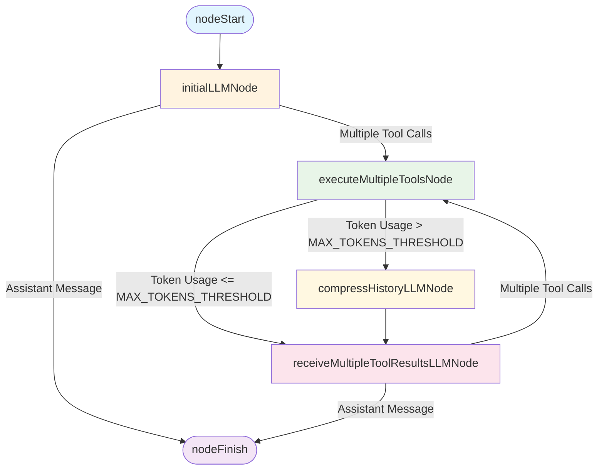

# Calculator Strategy Diagram

## Node Descriptions

- **nodeStart**: Entry point of the workflow
- **initialLLMNode**: Initial LLM request that can handle multiple responses
- **executeMultipleToolsNode**: Executes multiple tools in parallel
- **compressHistoryLLMNode**: Compresses conversation history when token limit is exceeded
- **receiveMultipleToolResultsLLMNode**: Processes multiple tool results from LLM
- **nodeFinish**: Exit point of the workflow

## Edge Conditions

- **Assistant Message**: Flow continues when LLM responds with a regular message
- **Multiple Tool Calls**: Flow branches when LLM requests multiple tool executions
- **Token Threshold**: Conditional routing based on token usage (MAX_TOKENS_THRESHOLD)