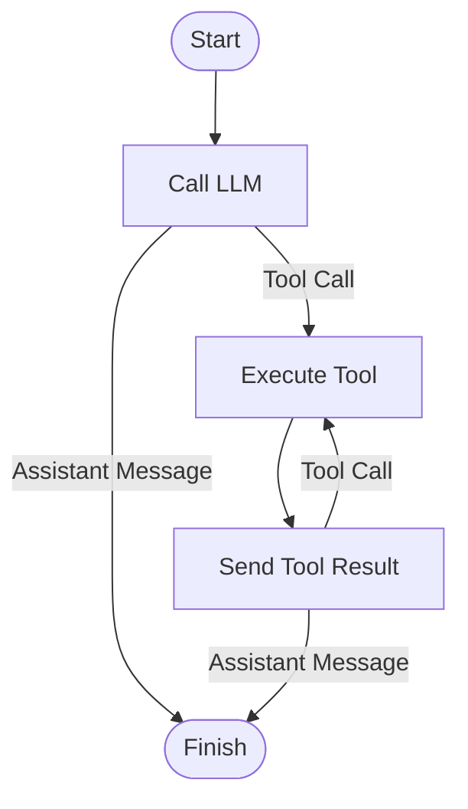

# Single Run Strategy

This document describes the single run mode strategy implementation.

## Flow Diagram

## Implementation Details

The `singleRunModeStrategy` function creates a strategy with the following components:

- **nodeCallLLM**: Handles single LLM requests
- **nodeExecuteTool**: Executes a single tool
- **nodeSendToolResult**: Sends tool result back to the LLM

The strategy supports conditional flow based on:

- Tool calls trigger tool execution
- Assistant messages lead to completion
- Tool results can either finish the process or trigger additional tool calls