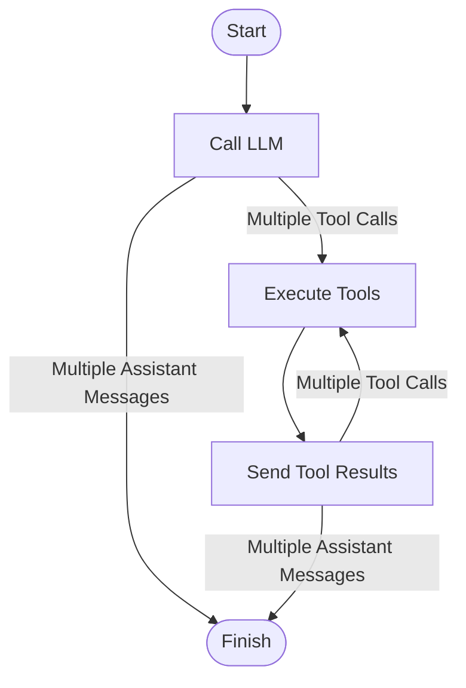

# Single Run With Parallel Strategy

This document describes the single run strategy implementation with parallel tool execution capability.

## Flow Diagram

## Implementation Details

The `singleRunWithParallelAbility` function creates a strategy with the following components:

- **nodeCallLLM**: Handles multiple LLM requests
- **nodeExecuteTool**: Executes multiple tools (with optional parallel execution)
- **nodeSendToolResult**: Sends multiple tool results back to the LLM

The strategy supports conditional flow based on:

- Multiple tool calls trigger tool execution
- Multiple assistant messages lead to completion
- Tool results can either finish the process or trigger additional tool calls